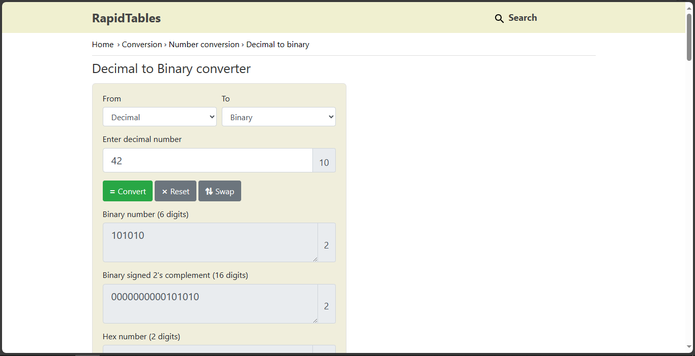

# 2Warm

## Overview
- Points: 50 Points
- Hint(s):
  - Hint #1: Submit your answer in our competition's flag format. For example, if your answer was '11111', you would submit 'picoCTF{11111}' as the flag.

## Description
> Can you convert the number 42 (base 10) to binary (base 2)?

## Solution
1. Go to [Rapid Tables - Decimal to Binary](https://www.rapidtables.com/convert/number/decimal-to-binary.html)
2. Paste the Decimal to convert.

## Flag
`picoCTF{101010}`
