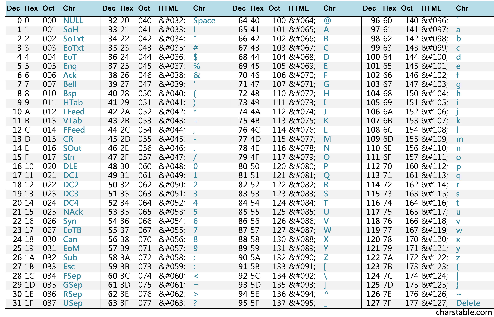

# Lets Warm Up

## Overview
- Points: 50 Points
- Hint(s):
  - Hint #1: Submit your answer in our flag format. For example, if your answer was 'hello', you would submit 'picoCTF{hello}' as the flag.

## Description
> If I told you a word started with 0x70 in hexadecimal, what would it start with in ASCII?

## Solution
1. Search for ASCII Table.
2. Manually find the Hex Code `0x70` / `70`.

## Alternative Solution
1. Open [CyberChef](https://gchq.github.io/CyberChef/) Tool to decode the Hex Code.
2. Type `0x70` on the Input Section.
3. Find the `From Hex` Operation.
4. Drag and drop it on the Recipe Section.

## Flag
`picoCTF{p}`
