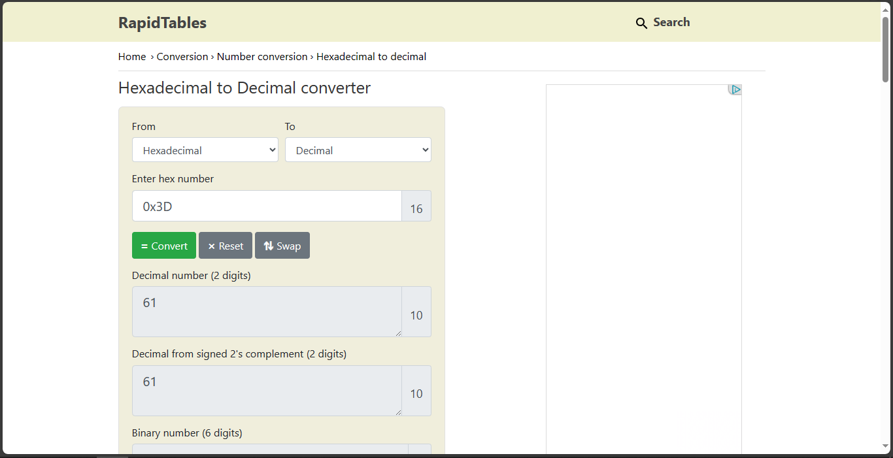

# Warmed Up

## Overview
- Points: 50 Points
- Hint(s):
  - Hint #1: Submit your answer in our flag format. For example, if your answer was '22', you would submit 'picoCTF{22}' as the flag.

## Description
> What is 0x3D (base 16) in decimal (base 10)?

## Solution
1. Go to [Rapid Tables - Hexadecimal to Decimal](https://www.rapidtables.com/convert/number/hex-to-decimal.html)
2. Paste the Hexadecimal to convert.

## Flag
`picoCTF{61}`
