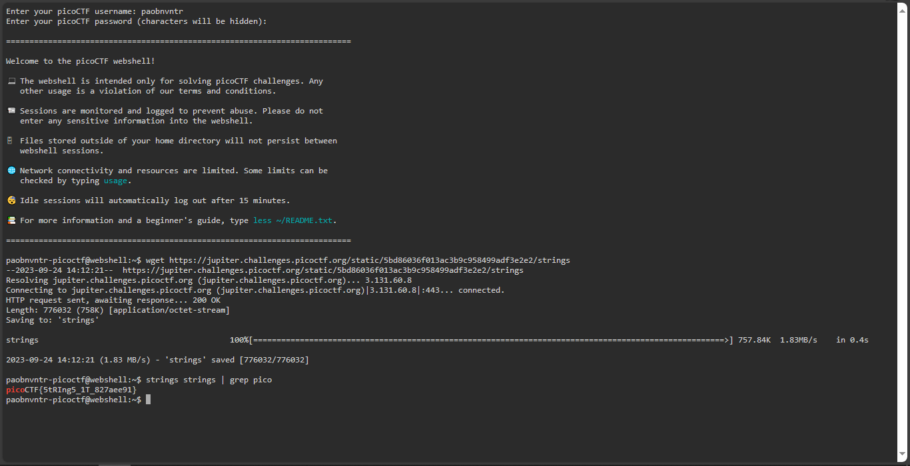

# strings it

## Overview
- Points: 100 Points
- Hint(s):
  - Hint #1: [strings](https://linux.die.net/man/1/strings)

## Description
> Can you find the flag in [file](./strings) without running it?

## Solution
1. Open the picoCTF Webshell.
2. Type `wget https://jupiter.challenges.picoctf.org/static/5bd86036f013ac3b9c958499adf3e2e2/strings`
3. Type `strings strings | grep pico`

## Flag
`picoCTF{5tRIng5_1T_827aee91}`
