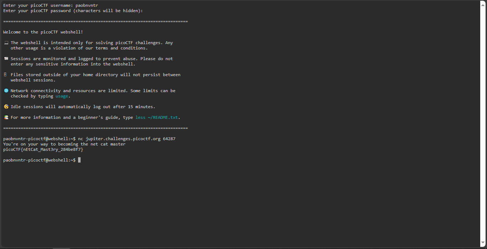

# what's a net cat?

## Overview
- Points: 100 Points
- Hint(s):
  - Hint #1: nc [tutorial](https://linux.die.net/man/1/nc)

## Description
> Using netcat (nc) is going to be pretty important. Can you connect to `jupiter.challenges.picoctf.org` at port `64287` to get the flag?

## Solution
1. Open the picoCTF Webshell.
2. Type `nc jupiter.challenges.picoctf.org 64287` 

## Flag
`picoCTF{nEtCat_Mast3ry_284be8f7}`
