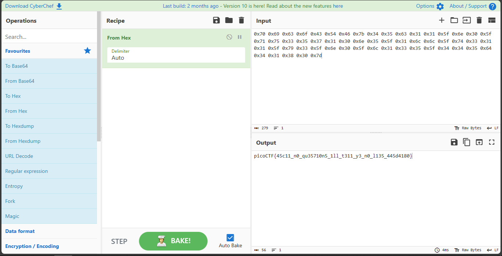

# ASCII Numbers

## Overview
- Points: 100 Points
- Hint(s):
  - Hint #1: CyberChef is a great tool for any encoding but especially ASCII.
  - Hint #2: Try CyberChef's 'From Hex' function

## Description
> Convert the following string of ASCII numbers into a readable string:
>
> 0x70 0x69 0x63 0x6f 0x43 0x54 0x46 0x7b 0x34 0x35
>
> 0x63 0x31 0x31 0x5f 0x6e 0x30 0x5f 0x71 0x75 0x33
>
> 0x35 0x37 0x31 0x30 0x6e 0x35 0x5f 0x31 0x6c 0x6c
>
> 0x5f 0x74 0x33 0x31 0x31 0x5f 0x79 0x33 0x5f 0x6e
>
> 0x30 0x5f 0x6c 0x31 0x33 0x35 0x5f 0x34 0x34 0x35
>
> 0x64 0x34 0x31 0x38 0x30 0x7d

## Solution
1. Open [CyberChef](https://gchq.github.io/CyberChef/) Tool to decode the Hex Code.
2. Copy and Paste the Hex Code on the Input Section.
3. Find the `From Hex` Operation.
4. Drag and drop it on the Recipe Section.

## Flag
`picoCTF{45c11_n0_qu35710n5_1ll_t311_y3_n0_l135_445d4180}`
