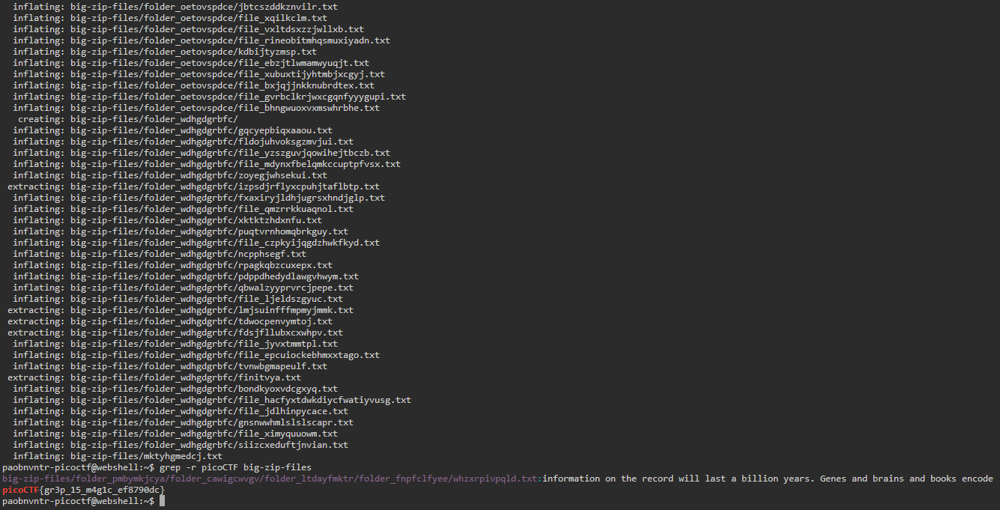

# Big Zip

## Overview
- Points: 100 Points
- Hint(s):
  - Hint #1: Can grep be instructed to look at every file in a directory and its subdirectories?

## Description
> Unzip this archive and find the flag.
>
> - [Download zip file](./big-zip-files.zip)

## Solution
1. Open the picoCTF Webshell
2. Download the file in the shell. Type `wget + file link` = `wget https://artifacts.picoctf.net/c/505/big-zip-files.zip`
3. Unzip the file. Type `unzip big-zip-files.zip`
4. When you unzip the file, it will show you the file structure but it is too many.
5. Type `grep -r picoCTF big-zip-files` to automatically find the flag.

## Flag
`picoCTF{gr3p_15_m4g1c_ef8790dc}`
