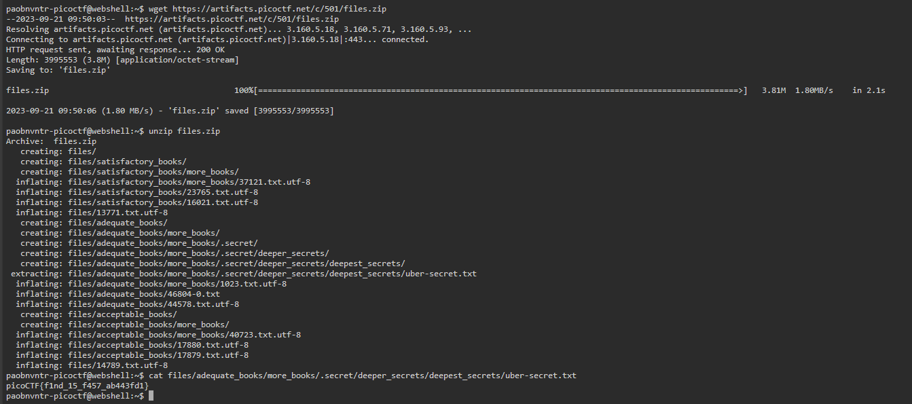

# First Find

## Overview
- Points: 100 Points
- Hints: (None)

## Description
> Unzip this archive and find the file named 'uber-secret.txt'
>
> - [Download zip file](./files.zip)

## Solution
1. Open the picoCTF Webshell
2. Download the file in the shell. Type `wget + file link` = `wget https://artifacts.picoctf.net/c/501/files.zip`
3. Unzip the file. Type `unzip files.zip`
4. When you unzip the file, it will show you the file structure. Find **uber-secret.txt**
5. Type `cat files/adequate_books/more_books/.secret/deeper_secrets/deepest_secrets/uber-secret.txt` to show the information inside **uber-secret.txt**

## Flag
`picoCTF{f1nd_15_f457_ab443fd1}`
